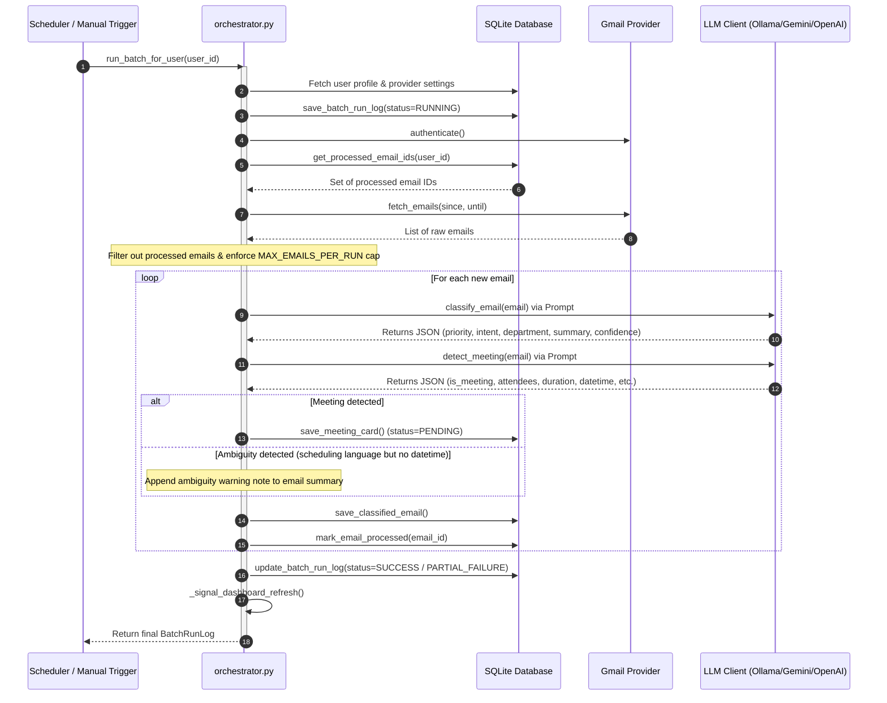

# Email Agentic System - Agent Architecture & Function Documentation

This document provides a comprehensive technical guide to the **Agentic** components, workflows, tools, database models, and functions of the Email Agentic system. It focuses exclusively on the agent-related files and functions that execute the email ingestion, classification, meeting detection, and data persistence tasks.

---

## 1. Architectural Flow

The core architecture follows a batch-processing, stateless pipeline driven by the background Scheduler or triggered manually via the API. The pipeline processes unread/unseen emails within a rolling window (24 hours by default), runs them through the LLM for classification and meeting detection, and stores the structured results in the database. 

Below is a sequence diagram illustrating how the components interact:



---

## 2. Component & Function Directory

The agent system is implemented across four primary modules:
1. **Orchestration**: Wires the pipeline steps together.
2. **LLM Client Interface**: Encapsulates LLM invocation, retries, and error handling.
3. **Agent Tools (Capabilities)**: Modular tools designed for specific classification tasks.
4. **Data Models & State Manager**: Structures agent output and persists state in SQLite.

---

### 2.1 Orchestration
Located in [orchestrator.py](file:///k:/Projects/Email%20Agent/Email%20Agentic%20Architecture/app/agents/orchestrator.py).

#### `run_batch_for_user(user_id: str, access_token: Optional[str] = None, ollama_model: Optional[str] = None) -> BatchRunLog`
*   **Purpose**: Main public entry point of the agent pipeline. Runs a full email processing cycle for a single user.
*   **Features**:
    *   Generates a unique `run_id` (UUID).
    *   Initializes the database session and saves a `BatchRunLog` record with the status `RUNNING`.
    *   Catches all unhandled top-level pipeline exceptions and writes a `FAILED` log to the DB to prevent crashes.
*   **Implementation**: Wraps the internal `_run_pipeline` function and handles database session cleanup (`finally: db.close()`).

#### `_run_pipeline(run_id: str, user_id: str, started_at: datetime, db: Session, access_token: Optional[str] = None, ollama_model: Optional[str] = None) -> BatchRunLog`
*   **Purpose**: Internal pipeline implementation containing the core operational sequence.
*   **Implementation Steps**:
    1.  **Load User Profile**: Retrieves the user's provider configurations (Gmail/Calendar).
    2.  **Authenticate API**: Authenticates with `GmailProvider`. If authentication fails, logs and finalizes the run as `FAILED`.
    3.  **Deduplicate**: Loads already-processed email IDs from the DB using `get_processed_email_ids()`.
    4.  **Fetch & Filter**: Downloads emails from the last 24 hours. Filters out previously processed email IDs.
    5.  **Enforce Limits**: Truncates the email list to `MAX_EMAILS_PER_RUN` (defaults to 500) to protect LLM context windows and API rate limits. Defers remaining emails.
    6.  **Loop Execution**: For each new email:
        *   Calls `classify_email()` to classify priority, intent, and department.
        *   Calls `detect_meeting()` to check for calendar invitation intents.
        *   Saves the results via `save_classified_email()` and `save_meeting_card()` if a meeting is found.
        *   Flags ambiguous calendar discussions (scheduling intent found but date/time is missing or unparseable) and appends a manual review warning note to the email summary.
        *   Marks the email as processed in the database.
    7.  **Finalize**: Calculates success statistics and writes the final `BatchRunLog` status (`SUCCESS` or `PARTIAL_FAILURE`).
    8.  **Signal**: Triggers `_signal_dashboard_refresh()` to alert the UI layer of new data.

#### `_finalize_run(...)`
*   **Purpose**: Helper to update the final metrics (emails fetched, processed, failed, deferred, meetings detected) and status of the current `BatchRunLogModel` in the DB.

#### `_make_log(...)`
*   **Purpose**: Instantiates and returns a Pydantic `BatchRunLog` model representation of the run.

#### `_signal_dashboard_refresh(user_id: str, run_id: str)`
*   **Purpose**: Currently acts as a placeholder logger for pushing notifications to the frontend UI (slated for event bus/WebSockets in future versions).

---

### 2.2 LLM Client Interface
Located in [llm_client.py](file:///k:/Projects/Email%20Agent/Email%20Agentic%20Architecture/app/tools/llm_client.py).

#### `LLMClient` (Class)
*   **Purpose**: Unified connection manager for local/remote LLMs. All agent tools execute text generations through this class.
*   **Supported Providers**:
    *   `ollama` (Local - Default: `qwen3:8b` or `qwen2.5-coder:7b`)
    *   `gemini` (Remote API - Default: `gemini-1.5-flash`)
    *   `openai` (Remote API - Default: `gpt-4o-mini`)
*   **Constructor (`__init__`)**:
    *   Loads configs from environment variables: `LLM_PROVIDER`, `OLLAMA_BASE_URL`, `LLM_TIMEOUT_SECONDS` (default: 30s), and `LLM_MAX_RETRIES` (default: 2).
*   **Methods**:
    *   `complete(system_prompt: str, user_prompt: str, model: Optional[str] = None) -> str`: Calls the configured LLM API. Integrates exponential backoff retries (`2 ** attempt`) for `httpx.TimeoutException` errors. Maps provider response formats to a standard string.
    *   `is_reachable() -> bool`: Verifies connection to the LLM backend or checks if API keys are present in `.env`.

#### `LLMClientError` (Exception Class)
*   **Purpose**: Custom exception wrapper that captures the source error and indicates whether the failure was due to a timeout (`is_timeout=True`) or a connection failure.

---

### 2.3 Agent Tools (Capabilities)

#### Email Classification
Located in [classify_email.py](file:///k:/Projects/Email%20Agent/Email%20Agentic%20Architecture/app/tools/classify_email.py).

*   **`classify_email(email: EmailObject, user_id: str, llm_client: LLMClient = None, llm_model: str = None) -> ClassifiedEmail`**
    *   **Purpose**: Classifies a single email subject and body into operational metadata and returns a `ClassifiedEmail` Pydantic model.
    *   **Features**:
        *   Triggers human review flagging (`flagged_for_review = True`) automatically if the LLM's classification confidence is below the defined threshold (default: `0.6`).
        *   Gracefully falls back to a default `ClassifiedEmail` structure (Priority=Low, Intent=Other, Department=General, Confidence=0.0) if the LLM fails or returns corrupted JSON.
    *   **Internal Helpers**:
        *   `_build_user_prompt(email)`: Formats sender information, subject line, and the body text.
        *   `_truncate_at_word_boundary(text, char_limit)`: Truncates email content to 6000 characters (~1500 tokens) at word boundaries to avoid truncation errors, appending `... [truncated]`.
        *   `_parse_llm_response(raw_response)`: Strips markdown wrappers (e.g. ` ```json `), isolates JSON brackets `{ ... }`, and parses it into a dictionary.
        *   `_build_classified_email(parsed, email, user_id)`: Maps raw dict inputs to typed enums (`Priority`, `IntentType`, `Department`), fallback-protects empty fields, and instances `ClassifiedEmail`.
        *   `_safe_enum(enum_class, value, default, ...)`: Validates and converts strings into the target Enum safely.

#### Meeting Detection
Located in [detect_meeting.py](file:///k:/Projects/Email%20Agent/Email%20Agentic%20Architecture/app/tools/detect_meeting.py).

*   **`detect_meeting(email: EmailObject, user_id: str, calendar_provider: CalendarProviderEnum, llm_client: LLMClient = None, llm_model: str = None) -> MeetingDetectionResult`**
    *   **Purpose**: Parses emails to identify calendar scheduling intents, extract event metadata, and build a reviewable `MeetingCard`.
    *   **Features**:
        *   If scheduling language is present but missing required parameters (like a specific date/time), returns `is_meeting=False` with `ambiguous=True`.
        *   Catches LLM parsing exceptions and safely treats them as non-meetings.
    *   **Internal Helpers**:
        *   `_build_result(parsed, email, user_id, calendar_provider)`: Evaluates LLM outcomes.
            *   *Scenario 1 (Valid Meeting)*: Extracts title, ISO-8601 datetime, duration, organizer, attendees, and video link to instantiate a `MeetingCard`.
            *   *Scenario 2 (Ambiguous)*: Generates an ambiguity note alerting the user to manually follow up.
            *   *Scenario 3 (No Meeting)*: Safely returns a negative result.
        *   `_parse_datetime(datetime_str, email_id)`: Attempts to parse extracted datetime text against multiple common ISO and time formats, applying UTC timezone offsets.

---

### 2.4 Data Store Operations
Located in [write_to_data_store.py](file:///k:/Projects/Email%20Agent/Email%20Agentic%20Architecture/app/tools/write_to_data_store.py).

This module contains database query wrapper functions that interface between Pydantic domain schemas and SQLAlchemy ORM models.

| Function Name | Operation Type | Table Impacted | Description |
| :--- | :--- | :--- | :--- |
| `save_classified_email` | **Insert** | `classified_emails` | Converts a `ClassifiedEmail` Pydantic model to a `ClassifiedEmailModel` record and commits it. Returns `False` and rolls back on exception. |
| `save_meeting_card` | **Insert** | `meeting_cards` | Serializes attendee lists into a JSON string and writes a `MeetingCardModel` record. |
| `save_batch_run_log` | **Insert** | `batch_run_logs` | Creates initial logs for tracking pipeline runs. |
| `mark_email_processed` | **Insert** | `processed_emails` | Records that an email has been handled by its Gmail ID, preventing duplicate parsing in future runs. |
| `get_processed_email_ids` | **Query** | `processed_emails` | Fetches a Python `set` of processed email IDs for the current user to support quick deduplication checks. |
| `update_meeting_status` | **Update** | `meeting_cards` | Sets a meeting's status to `ADDED` or `DISMISSED`. Called when users interact with the dashboard. |
| `update_batch_run_log` | **Update** | `batch_run_logs` | Updates processing statistics (successes, errors, etc.) and sets the final run status. |

---

### 2.5 Background Scheduler
Located in [scheduler.py](file:///k:/Projects/Email%20Agent/Email%20Agentic%20Architecture/app/scheduler/scheduler.py).

#### `start_scheduler() -> None`
*   **Purpose**: Activates the background interval scheduling process via `APScheduler`.
*   **Rules**:
    *   Registers one unique interval job per active user found in the DB.
    *   Interval duration is set by `BATCH_INTERVAL_MINUTES` (defaults to 60).
    *   Executes an initial run *immediately* on startup (`next_run_time=datetime.now()`) to populate the user dashboard.
    *   Enforces `max_instances=1` per job. If a previous run is still processing, the overlapping job trigger is skipped.

#### `stop_scheduler() -> None`
*   **Purpose**: Shuts down the background scheduler gracefully, waiting for running jobs to finish.

#### `_run_batch_job(user_id: str) -> None`
*   **Purpose**: Job trigger wrapper that loads context, invokes `run_batch_for_user()`, and captures all exceptions so scheduler threads do not die from unexpected runtime errors.

#### `_job_listener(event)`
*   **Purpose**: Log listener capturing scheduler statuses (`EVENT_JOB_EXECUTED`, `EVENT_JOB_ERROR`, `EVENT_JOB_MISSED`). Logs warnings if overlapping runs are skipped.

---

## 3. Data Schema & Domain Models

### 3.1 Pydantic Domain Models
*   **`ClassifiedEmail`** (in [classified_email.py](file:///k:/Projects/Email%20Agent/Email%20Agentic%20Architecture/app/models/classified_email.py)):
    *   Main schema representing the LLM classification results.
    *   Includes a `@model_validator(mode="after")` to automatically force `flagged_for_review = True` if `classification_confidence` falls below `0.6`.
*   **`MeetingCard`** (in [base.py](file:///k:/Projects/Email%20Agent/Email%20Agentic%20Architecture/app/providers/calendar/base.py)):
    *   Main schema representing extracted calendar invitation results.
    *   Includes a `@field_serializer` to output timezone-aware ISO string formats for datetimes.

### 3.2 SQLAlchemy Database Models
Mapped to the SQLite database via [models.py](file:///k:/Projects/Email%20Agent/Email%20Agentic%20Architecture/app/db/models.py).

*   **`UserModel`**: Stores configuration, active state, and calendar provider preferences per user.
*   **`ProcessedEmailModel`**: Stores unique `email_id` and `user_id` pairings to track processed state.
*   **`ClassifiedEmailModel`**: Stores summary, department, priority, intent, and review flags.
*   **`MeetingCardModel`**: Stores titles, datetimes, attendee lists, location/link, and current review status.
*   **`BatchRunLogModel`**: Keeps track of pipeline batch history, processing performance, and critical failures.

---

## 4. Key Agent Safety & Implementation Constraints

### 4.1 Non-Autonomous Actions (Humans in the Loop)
A key architectural guardrail is built into calendar integration:
*   The `CalendarProvider`'s `add_event()` method is **never** invoked autonomously by the agent during a batch run.
*   Instead, when a meeting invite is identified, the agent creates a `MeetingCard` with the status `PENDING` and persists it.
*   The user must explicitly click "Confirm" or "Dismiss" on the frontend dashboard. This sends a request to the [meetings.py](file:///k:/Projects/Email%20Agent/Email%20Agentic%20Architecture/app/api/meetings.py) endpoint (`confirm_meeting` or `dismiss_meeting`), which is the only place authorized to call `add_event()` and write to the user's actual calendar.

### 4.2 Graceful Degradation & LLM Failures
To ensure robustness against model outages or rate limits, the system features multiple levels of fallback protection:
1.  **LLM Failure Protection**: If the LLM goes offline or fails to parse, default fallbacks classify the email as `Priority.LOW`, `IntentType.OTHER`, and `Department.GENERAL`, setting the confidence to `0.0`.
2.  **Validation Review Trigger**: Any classification with a confidence score under `0.6` (including default fallbacks) is automatically flagged for review. Flagged emails are highlighted on the dashboard for manual human validation.
3.  **Individual Email Isolations**: Exceptions occurring during the parsing of one email are caught, logged, and skipped. The orchestrator continues processing the remaining emails in the batch instead of aborting the pipeline.
